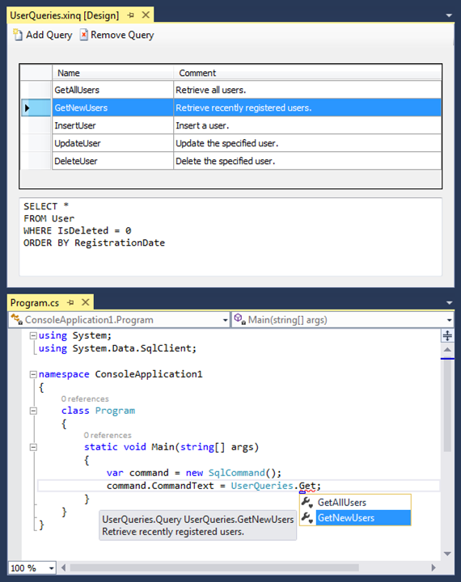

# Xinq
Xinq makes it extremely easy to manage database queries inside Visual Studio.

## Screenshots


## Download

- Visual Studio 2022: [xinq-v1.0.8.vsix](https://github.com/soheilpro/Xinq/releases/download/v1.0.8/xinq-v1.0.8.vsix)
- Visual Studio 2019: [xinq-v1.0.7.vsix](https://github.com/soheilpro/Xinq/releases/download/v1.0.7/xinq-v1.0.7.vsix)
- Visual Studio 2013/2015/2017: [xinq-v1.0.5.vsix](https://github.com/soheilpro/Xinq/releases/download/v1.0.5/xinq-v1.0.5.vsix)
- Visual Studio 2010/2012: [xinq-v1.0.2-vs10_11.vsix](https://github.com/soheilpro/Xinq/releases/download/v1.0.2-vs10_11/xinq-v1.0.2-vs10_11.vsix)

## Install
Double-click the downloaded .vsix file to install it.

## Usage

1. Add an **XML Integrated Query** file to your project.
2. Use the presented designer to add and edit queries.
3. Reference queries in your code:
   ```
   command.CommandText = UserQueries.GetNewUsers.Text;
   ```

## Version History
+ **1.0.8**
  + Added support for Visual Studio 2022.
+ **1.0.7**
  + Added support for Visual Studio 2019.
  + Fixed null exception when opening queries in Visual Studio 2019.
+ **1.0.5**
  + Added support for Visual Studio 2017.
  + Enabled scroll bars for the text editor.
+ **1.0.4**
  + Fixed a bug in generating the Queries class.
+ **1.0.3**
  + Added support for Visual Studio 2015.
+ **1.0.2**
	+ Initial release

## Author
**Soheil Rashidi**

+ http://soheilrashidi.com
+ http://twitter.com/soheilpro
+ http://github.com/soheilpro

## Copyright and License
Copyright 2021 Soheil Rashidi

Licensed under the The MIT License (the "License");
you may not use this work except in compliance with the License.
You may obtain a copy of the License in the LICENSE file, or at:

http://www.opensource.org/licenses/mit-license.php

Unless required by applicable law or agreed to in writing, software
distributed under the License is distributed on an "AS IS" BASIS,
WITHOUT WARRANTIES OR CONDITIONS OF ANY KIND, either express or implied.
See the License for the specific language governing permissions and
limitations under the License.
